# WB AC-95 Bangaon Uttar — Comprehensive Simulation Report

*n = 100 agents · 53 monthly ticks (2020-01 → 2024-05) · Park-minimal LLM updater (Haiku 4.5)*

## 1. Headline numbers

### Raw final-vote query (LLM directly asked who they would vote for)

| Party | n | sim % | ECI ground truth % | gap |
|---|---|---|---|---|
| BJP | 41 | 41.0% | 49.8% | -8.8pp |
| AITC | 41 | 41.0% | 39.5% | 1.5pp |
| INC | 6 | 6.0% | 1.5% | 4.5pp |
| LF | 5 | 5.0% | 4.5% | 0.5pp |
| NOTA | 7 | 7.0% | 0.8% | 6.2pp |
| Other | 0 | 0.0% | 4.7% | -4.7pp |

### Bucketed (Left+INC merged, NOTA → Undecided)

| Party bucket | n | % |
|---|---|---|
| BJP | 41 | 41.0% |
| AITC | 41 | 41.0% |
| Left+INC | 11 | 11.0% |
| Other | 0 | 0.0% |
| Undecided | 7 | 7.0% |

**Stayed with 2019 prior**: 85/100 (85.0%)  

**Switched lean**: 15/100 (15.0%)

> **Read this first.** The Park-minimal updater asks the LLM to 
> integrate persona + memory + new event each month and emit a 
> structured delta. Most events emit `party_lean_change=no_change` 
> — that's by design. Movement crystallizes at final-vote-query time, 
> when the LLM integrates the *whole* memory stream against persona 
> commitments. So the 'switcher matrix' (2019 prior → 2024 vote) is 
> the single best signal.

## 2. Visual tour (8 plots)

### `vote_redistribution.png`

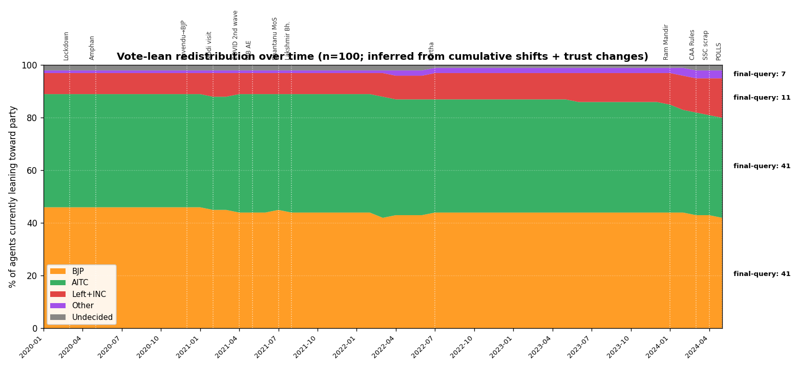

*Stacked area: % of agents currently leaning each party, every month. Inferred from cumulative shifts + trust changes (anchor=2.0 on 2019 prior). Vertical labels mark major events.*

### `switches_over_time.png`

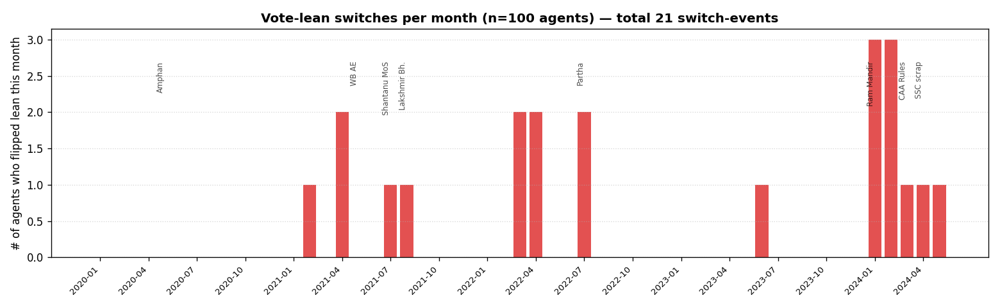

*Bar: how many agents flipped their inferred lean in each month. Spikes track the events that genuinely moved people.*

### `trust_evolution.png`

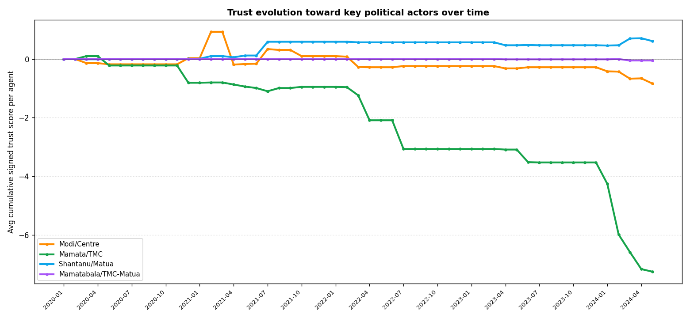

*Avg cumulative signed trust score per agent toward each political actor (Modi/Centre, Mamata/TMC, Shantanu/Matua, Mamatabala/TMC-Matua). This is the cleanest sentiment signal — captures movement that `party_lean_change` doesn't.*

### `party_momentum.png`

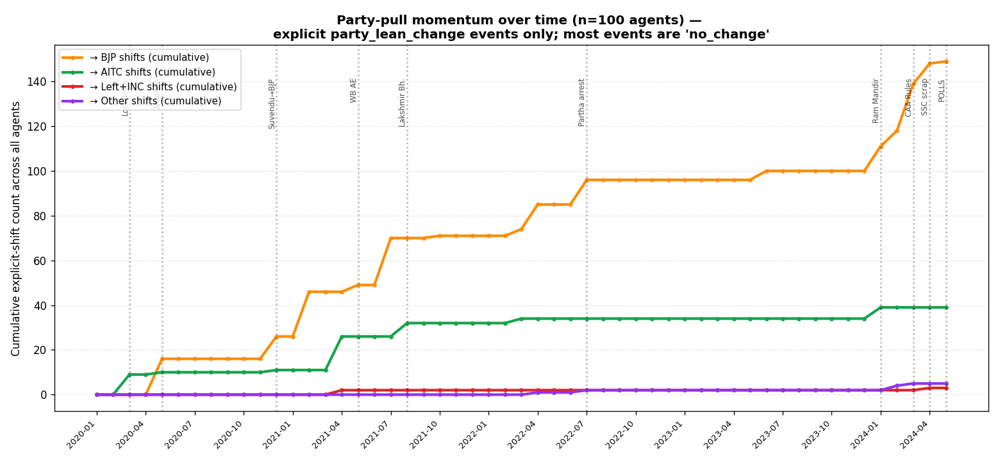

*Cumulative count of explicit `more_X` deltas across all agents. Sparse signal — most events are `no_change` — but useful for seeing which events broke the threshold.*

### `event_impact.png`

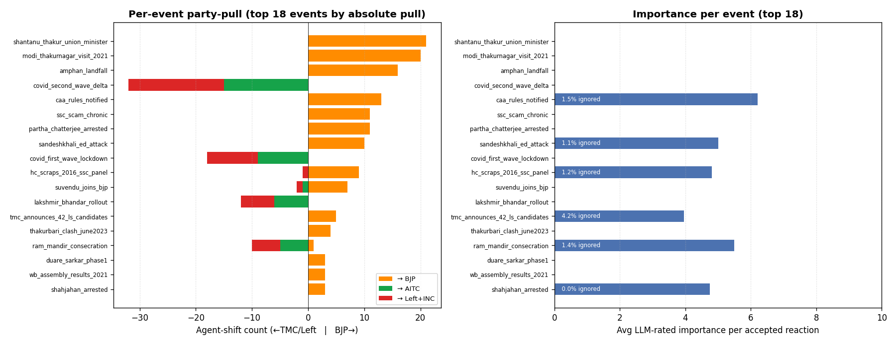

*Top 18 events by absolute political pull, plus ignore-rate and average-importance per accepted reaction.*

### `switcher_matrix.png`

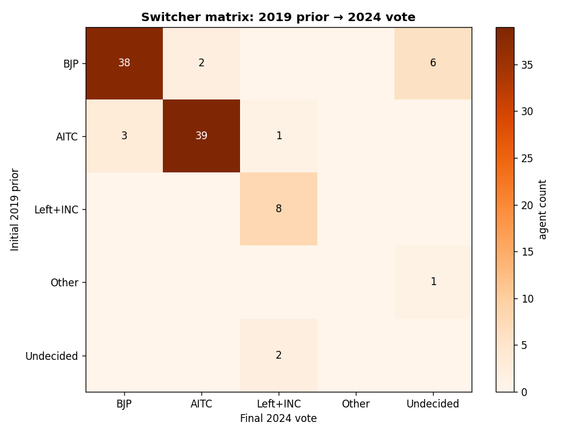

*2019 prior × 2024 final vote heatmap. Diagonal = stayed. Off-diagonal = switched. Watch the AITC→BJP and Undecided→AITC cells.*

### `demographic_trajectories.png`

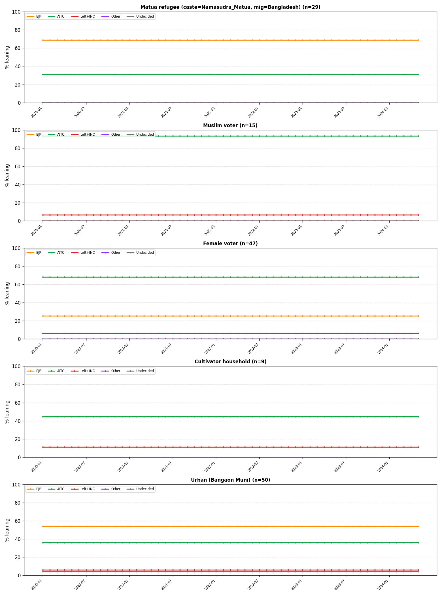

*Vote-share over time within key demographic slices (Matua refugees, Muslim voters, women, cultivators, urban Bangaon).*

### `vote_by_demographic.png`

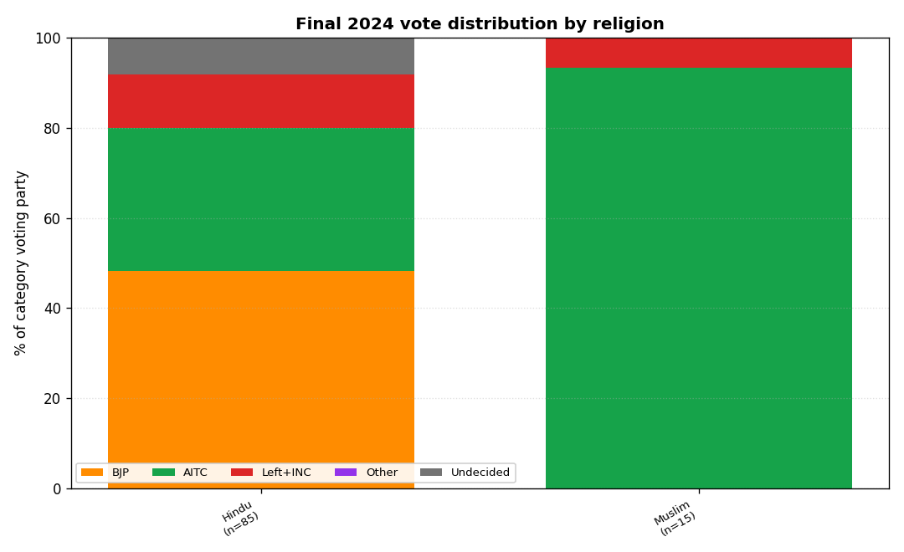

*Final vote distribution within each major demographic axis (religion, caste, gender, age, location, welfare beneficiary, 2019 prior, education).*

## 3. Demographic deep-dives

### 3.1 Final vote × demographic axis (full breakdown)

#### `religion`

| category | n | BJP | AITC | INC | LF | Other | NOTA |
|---|---|---|---|---|---|---|---|
| Hindu | 85 | 41 (48%) | 27 (32%) | 5 (6%) | 5 (6%) | 0 (0%) | 7 (8%) |
| Muslim | 15 | 0 (0%) | 14 (93%) | 1 (7%) | 0 (0%) | 0 (0%) | 0 (0%) |

#### `caste`

| category | n | BJP | AITC | INC | LF | Other | NOTA |
|---|---|---|---|---|---|---|---|
| Namasudra_Matua | 36 | 23 (64%) | 12 (33%) | 0 (0%) | 0 (0%) | 0 (0%) | 1 (3%) |
| Other_Hindu_middle_castes | 26 | 12 (46%) | 6 (23%) | 2 (8%) | 3 (12%) | 0 (0%) | 3 (12%) |
| Muslim | 15 | 0 (0%) | 14 (93%) | 1 (7%) | 0 (0%) | 0 (0%) | 0 (0%) |
| UC_bhadralok | 11 | 4 (36%) | 3 (27%) | 2 (18%) | 1 (9%) | 0 (0%) | 1 (9%) |
| ST_total | 4 | 0 (0%) | 2 (50%) | 0 (0%) | 1 (25%) | 0 (0%) | 1 (25%) |
| OBC_specific | 3 | 1 (33%) | 1 (33%) | 1 (33%) | 0 (0%) | 0 (0%) | 0 (0%) |
| Bagdi | 2 | 0 (0%) | 2 (100%) | 0 (0%) | 0 (0%) | 0 (0%) | 0 (0%) |
| Other_SC | 2 | 1 (50%) | 0 (0%) | 0 (0%) | 0 (0%) | 0 (0%) | 1 (50%) |

#### `gender`

| category | n | BJP | AITC | INC | LF | Other | NOTA |
|---|---|---|---|---|---|---|---|
| Male | 53 | 28 (53%) | 12 (23%) | 2 (4%) | 5 (9%) | 0 (0%) | 6 (11%) |
| Female | 47 | 13 (28%) | 29 (62%) | 4 (9%) | 0 (0%) | 0 (0%) | 1 (2%) |

#### `age_cohort`

| category | n | BJP | AITC | INC | LF | Other | NOTA |
|---|---|---|---|---|---|---|---|
| 28_32 | 14 | 7 (50%) | 3 (21%) | 1 (7%) | 1 (7%) | 0 (0%) | 2 (14%) |
| 23_27 | 13 | 6 (46%) | 5 (38%) | 2 (15%) | 0 (0%) | 0 (0%) | 0 (0%) |
| 43_47 | 13 | 3 (23%) | 9 (69%) | 1 (8%) | 0 (0%) | 0 (0%) | 0 (0%) |
| 33_37 | 13 | 4 (31%) | 6 (46%) | 0 (0%) | 0 (0%) | 0 (0%) | 3 (23%) |
| 38_42 | 9 | 4 (44%) | 5 (56%) | 0 (0%) | 0 (0%) | 0 (0%) | 0 (0%) |
| 18_22 | 9 | 6 (67%) | 3 (33%) | 0 (0%) | 0 (0%) | 0 (0%) | 0 (0%) |
| 48_52 | 8 | 3 (38%) | 3 (38%) | 2 (25%) | 0 (0%) | 0 (0%) | 0 (0%) |
| 53_57 | 7 | 2 (29%) | 4 (57%) | 0 (0%) | 0 (0%) | 0 (0%) | 1 (14%) |
| 58_62 | 6 | 3 (50%) | 1 (17%) | 0 (0%) | 2 (33%) | 0 (0%) | 0 (0%) |
| 63_67 | 5 | 1 (20%) | 2 (40%) | 0 (0%) | 2 (40%) | 0 (0%) | 0 (0%) |
| 68plus | 3 | 2 (67%) | 0 (0%) | 0 (0%) | 0 (0%) | 0 (0%) | 1 (33%) |

#### `gp_location`

| category | n | BJP | AITC | INC | LF | Other | NOTA |
|---|---|---|---|---|---|---|---|
| U2_CDB_rural | 50 | 19 (38%) | 24 (48%) | 2 (4%) | 3 (6%) | 0 (0%) | 2 (4%) |
| U1_Muni | 50 | 22 (44%) | 17 (34%) | 4 (8%) | 2 (4%) | 0 (0%) | 5 (10%) |

#### `welfare_dominant`

| category | n | BJP | AITC | INC | LF | Other | NOTA |
|---|---|---|---|---|---|---|---|
| Khadya_Sathi | 36 | 16 (44%) | 16 (44%) | 1 (3%) | 2 (6%) | 0 (0%) | 1 (3%) |
| None | 20 | 11 (55%) | 2 (10%) | 2 (10%) | 1 (5%) | 0 (0%) | 4 (20%) |
| Kanyashree | 18 | 6 (33%) | 10 (56%) | 2 (11%) | 0 (0%) | 0 (0%) | 0 (0%) |
| Swasthya_Sathi | 15 | 5 (33%) | 7 (47%) | 0 (0%) | 1 (7%) | 0 (0%) | 2 (13%) |
| Krishak_Bandhu | 11 | 3 (27%) | 6 (55%) | 1 (9%) | 1 (9%) | 0 (0%) | 0 (0%) |

#### `vote_2019_LS`

| category | n | BJP | AITC | INC | LF | Other | NOTA |
|---|---|---|---|---|---|---|---|
| BJP | 46 | 38 (83%) | 2 (4%) | 0 (0%) | 0 (0%) | 0 (0%) | 6 (13%) |
| AITC | 43 | 3 (7%) | 39 (91%) | 1 (2%) | 0 (0%) | 0 (0%) | 0 (0%) |
| INC | 4 | 0 (0%) | 0 (0%) | 4 (100%) | 0 (0%) | 0 (0%) | 0 (0%) |
| LF | 4 | 0 (0%) | 0 (0%) | 0 (0%) | 4 (100%) | 0 (0%) | 0 (0%) |
| Left_INC_combined | 2 | 0 (0%) | 0 (0%) | 1 (50%) | 1 (50%) | 0 (0%) | 0 (0%) |

#### `education`

| category | n | BJP | AITC | INC | LF | Other | NOTA |
|---|---|---|---|---|---|---|---|
| Middle | 22 | 8 (36%) | 8 (36%) | 2 (9%) | 2 (9%) | 0 (0%) | 2 (9%) |
| Primary | 20 | 7 (35%) | 11 (55%) | 1 (5%) | 1 (5%) | 0 (0%) | 0 (0%) |
| Secondary | 19 | 9 (47%) | 9 (47%) | 0 (0%) | 0 (0%) | 0 (0%) | 1 (5%) |
| Higher_Secondary | 14 | 7 (50%) | 6 (43%) | 0 (0%) | 0 (0%) | 0 (0%) | 1 (7%) |
| Graduate | 11 | 6 (55%) | 2 (18%) | 2 (18%) | 0 (0%) | 0 (0%) | 1 (9%) |
| Illiterate | 11 | 4 (36%) | 5 (45%) | 0 (0%) | 1 (9%) | 0 (0%) | 1 (9%) |
| Postgraduate | 3 | 0 (0%) | 0 (0%) | 1 (33%) | 1 (33%) | 0 (0%) | 1 (33%) |

#### `economic_status`

| category | n | BJP | AITC | INC | LF | Other | NOTA |
|---|---|---|---|---|---|---|---|
| Above_Poverty_Line_low_income | 39 | 12 (31%) | 22 (56%) | 1 (3%) | 1 (3%) | 0 (0%) | 3 (8%) |
| BPL_household | 26 | 11 (42%) | 11 (42%) | 1 (4%) | 2 (8%) | 0 (0%) | 1 (4%) |
| Lower_middle | 22 | 10 (45%) | 6 (27%) | 3 (14%) | 1 (5%) | 0 (0%) | 2 (9%) |
| Middle | 10 | 5 (50%) | 2 (20%) | 1 (10%) | 1 (10%) | 0 (0%) | 1 (10%) |
| Upper_middle_well_off | 3 | 3 (100%) | 0 (0%) | 0 (0%) | 0 (0%) | 0 (0%) | 0 (0%) |

#### `migration`

| category | n | BJP | AITC | INC | LF | Other | NOTA |
|---|---|---|---|---|---|---|---|
| Native | 60 | 16 (27%) | 30 (50%) | 6 (10%) | 4 (7%) | 0 (0%) | 4 (7%) |
| Bangladesh | 29 | 20 (69%) | 8 (28%) | 0 (0%) | 0 (0%) | 0 (0%) | 1 (3%) |
| WB_other_district | 8 | 3 (38%) | 3 (38%) | 0 (0%) | 1 (12%) | 0 (0%) | 1 (12%) |
| Other_Indian_state | 3 | 2 (67%) | 0 (0%) | 0 (0%) | 0 (0%) | 0 (0%) | 1 (33%) |

### 3.2 Trust evolution split by demographic

Each PNG below shows the four-actor trust trace, but split by category. Compare the slopes — divergence between categories 
is exactly the political-segmentation signal.

#### Trust by `religion`

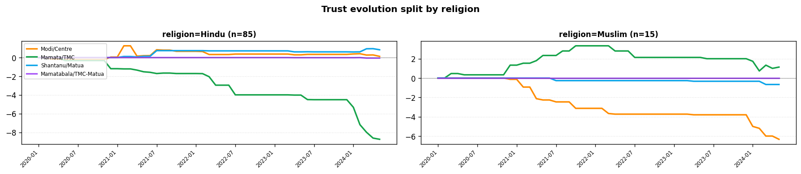

#### Trust by `caste`

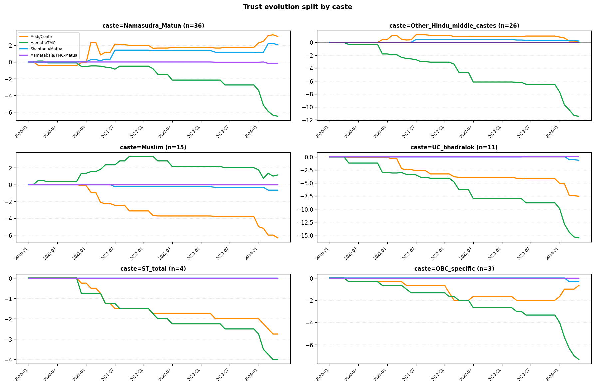

#### Trust by `gender`

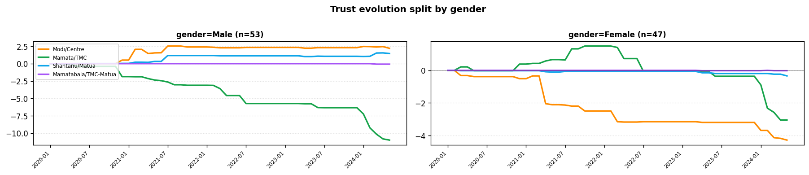

#### Trust by `vote_2019_LS`

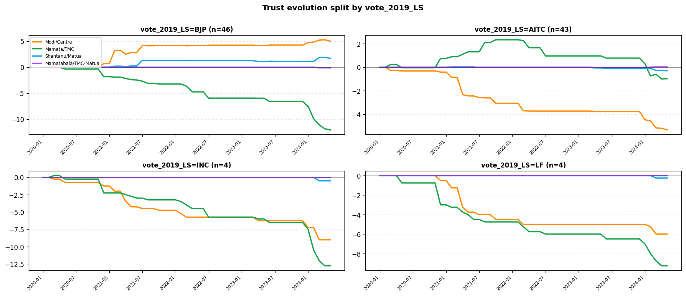

#### Trust by `welfare_dominant`

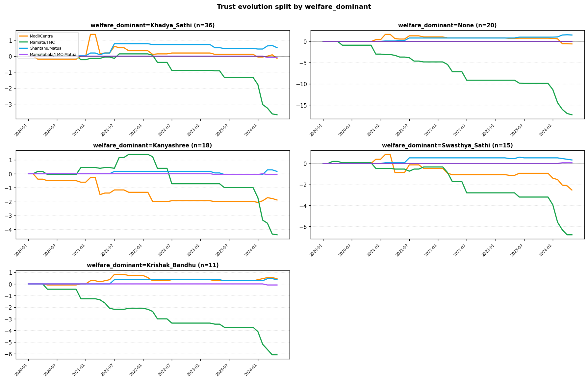

## 4. Ignore-rate by demographic

From `ignore_rate_by_demographic.json` — fraction of delivered events that the agent decided to scroll past:

### `religion`
| category | ignore rate |
|---|---|
| Hindu | 7.2% |
| Muslim | 6.3% |

### `caste`
| category | ignore rate |
|---|---|
| ST_total | 15.2% |
| OBC_specific | 12.9% |
| UC_bhadralok | 8.7% |
| Namasudra_Matua | 7.0% |
| Muslim | 6.3% |
| Other_Hindu_middle_castes | 6.0% |
| Poundra | 0.0% |
| Bagdi | 0.0% |
| Other_SC | 0.0% |

### `gender`
| category | ignore rate |
|---|---|
| Female | 7.4% |
| Male | 6.7% |

### `age_cohort`
| category | ignore rate |
|---|---|
| 53_57 | 11.6% |
| 68plus | 10.9% |
| 18_22 | 9.8% |
| 33_37 | 7.5% |
| 28_32 | 7.3% |
| 23_27 | 6.3% |
| 48_52 | 6.2% |
| 43_47 | 5.8% |
| 58_62 | 5.1% |
| 38_42 | 4.6% |
| 63_67 | 3.8% |

### `gp_location`
| category | ignore rate |
|---|---|
| U2_CDB_rural | 7.1% |
| U1_Muni | 7.0% |

### `education`
| category | ignore rate |
|---|---|
| Graduate | 8.7% |
| Middle | 8.7% |
| Illiterate | 8.0% |
| Postgraduate | 7.9% |
| Higher_Secondary | 6.9% |
| Secondary | 5.6% |
| Primary | 5.2% |

### `workforce_status`
| category | ignore rate |
|---|---|
| Student | 13.0% |
| Unemployed | 10.1% |
| Non_worker | 6.6% |
| Main_worker | 6.1% |
| Marginal_worker | 4.4% |

### `economic_status`
| category | ignore rate |
|---|---|
| Lower_middle | 9.0% |
| Middle | 8.2% |
| BPL_household | 6.6% |
| Upper_middle_well_off | 6.3% |
| Above_Poverty_Line_low_income | 6.0% |

## 5. Per-event analysis (all 38 events)

For each event: delivery + acceptance rates, importance, net party-pull (BJP shifts − AITC shifts), and demographics that reacted most strongly.

### `amphan_landfall`
- **delivered**: 85 agent-deliveries  
- **accepted**: 85 (ignore rate: 0.0%)  
- **avg importance** (1-10): 0  
- **shifts**: →BJP=16, →AITC=0, →Left+INC=0, →Other=0, no_change=69  
- **net BJP − AITC**: +16

  By **religion**: Hindu=net+16/imp0.0, Muslim=net+0/imp0.0
  Top-3 castes by abs-pull: Other_Hindu_middle_castes=+10, Namasudra_Matua=+3, UC_bhadralok=+2
  By **gender**: Female=net+2/imp0.0, Male=net+14/imp0.0

### `bengal_heatwave_2024`
- **delivered**: 21 agent-deliveries  
- **accepted**: 20 (ignore rate: 4.8%)  
- **avg importance** (1-10): 3.1  
- **shifts**: →BJP=0, →AITC=0, →Left+INC=0, →Other=0, no_change=20  
- **net BJP − AITC**: +0

  By **religion**: Hindu=net+0/imp3.12, Muslim=net+0/imp3.0
  By **gender**: Male=net+0/imp3.12, Female=net+0/imp3.0

### `bsf_50km_jurisdiction`
- **delivered**: 86 agent-deliveries  
- **accepted**: 79 (ignore rate: 8.1%)  
- **avg importance** (1-10): 0  
- **shifts**: →BJP=1, →AITC=0, →Left+INC=0, →Other=0, no_change=78  
- **net BJP − AITC**: +1

  By **religion**: Hindu=net+1/imp0.0, Muslim=net+0/imp0.0
  Top-3 castes by abs-pull: Namasudra_Matua=+1
  By **gender**: Female=net+0/imp0.0, Male=net+1/imp0.0

### `caa_rules_notified`
- **delivered**: 68 agent-deliveries  
- **accepted**: 67 (ignore rate: 1.5%)  
- **avg importance** (1-10): 6.21  
- **shifts**: →BJP=13, →AITC=0, →Left+INC=0, →Other=0, no_change=54  
- **net BJP − AITC**: +13

  By **religion**: Hindu=net+13/imp6.25, Muslim=net+0/imp6.0
  Top-3 castes by abs-pull: Namasudra_Matua=+12, UC_bhadralok=+1
  By **gender**: Female=net+3/imp5.97, Male=net+10/imp6.41

### `covid_first_wave_lockdown`
- **delivered**: 66 agent-deliveries  
- **accepted**: 66 (ignore rate: 0.0%)  
- **avg importance** (1-10): 0  
- **shifts**: →BJP=0, →AITC=9, →Left+INC=0, →Other=0, no_change=57  
- **net BJP − AITC**: -9

  By **religion**: Hindu=net-6/imp0.0, Muslim=net-3/imp0.0
  Top-3 castes by abs-pull: Namasudra_Matua=-5, Muslim=-3, UC_bhadralok=-1
  By **gender**: Female=net-8/imp0.0, Male=net-1/imp0.0

### `covid_second_wave_delta`
- **delivered**: 85 agent-deliveries  
- **accepted**: 85 (ignore rate: 0.0%)  
- **avg importance** (1-10): 0  
- **shifts**: →BJP=0, →AITC=15, →Left+INC=2, →Other=0, no_change=68  
- **net BJP − AITC**: -15

  By **religion**: Hindu=net-13/imp0.0, Muslim=net-2/imp0.0
  Top-3 castes by abs-pull: Namasudra_Matua=-9, UC_bhadralok=-2, Muslim=-2
  By **gender**: Female=net-12/imp0.0, Male=net-3/imp0.0

### `cyclone_yaas_landfall`
- **delivered**: 53 agent-deliveries  
- **accepted**: 52 (ignore rate: 1.9%)  
- **avg importance** (1-10): 0  
- **shifts**: →BJP=0, →AITC=0, →Left+INC=0, →Other=0, no_change=52  
- **net BJP − AITC**: +0

  By **religion**: Hindu=net+0/imp0.0, Muslim=net+0/imp0.0
  By **gender**: Female=net+0/imp0.0, Male=net+0/imp0.0

### `duare_sarkar_phase1`
- **delivered**: 89 agent-deliveries  
- **accepted**: 87 (ignore rate: 2.2%)  
- **avg importance** (1-10): 0  
- **shifts**: →BJP=3, →AITC=0, →Left+INC=0, →Other=0, no_change=84  
- **net BJP − AITC**: +3

  By **religion**: Hindu=net+3/imp0.0, Muslim=net+0/imp0.0
  Top-3 castes by abs-pull: Other_Hindu_middle_castes=+2, UC_bhadralok=+1
  By **gender**: Female=net+0/imp0.0, Male=net+3/imp0.0

### `electoral_bonds_disclosure`
- **delivered**: 49 agent-deliveries  
- **accepted**: 36 (ignore rate: 26.5%)  
- **avg importance** (1-10): 3.31  
- **shifts**: →BJP=0, →AITC=0, →Left+INC=0, →Other=0, no_change=36  
- **net BJP − AITC**: +0

  By **religion**: Hindu=net+0/imp3.35, Muslim=net+0/imp2.5
  By **gender**: Male=net+0/imp3.11, Female=net+0/imp4.0

### `first_caa_certificates`
- **delivered**: 58 agent-deliveries  
- **accepted**: 58 (ignore rate: 0.0%)  
- **avg importance** (1-10): 4.9  
- **shifts**: →BJP=1, →AITC=0, →Left+INC=0, →Other=0, no_change=57  
- **net BJP − AITC**: +1

  By **religion**: Hindu=net+1/imp5.12, Muslim=net+0/imp3.8
  Top-3 castes by abs-pull: Namasudra_Matua=+1
  By **gender**: Female=net+0/imp4.68, Male=net+1/imp5.03

### `hc_scraps_2016_ssc_panel`
- **delivered**: 81 agent-deliveries  
- **accepted**: 80 (ignore rate: 1.2%)  
- **avg importance** (1-10): 4.81  
- **shifts**: →BJP=9, →AITC=0, →Left+INC=1, →Other=0, no_change=70  
- **net BJP − AITC**: +9

  By **religion**: Hindu=net+9/imp4.94, Muslim=net+0/imp3.9
  Top-3 castes by abs-pull: Namasudra_Matua=+4, Other_Hindu_middle_castes=+3, UC_bhadralok=+2
  By **gender**: Female=net+1/imp4.35, Male=net+8/imp5.28

### `kejriwal_arrested`
- **delivered**: 35 agent-deliveries  
- **accepted**: 33 (ignore rate: 5.7%)  
- **avg importance** (1-10): 4.45  
- **shifts**: →BJP=0, →AITC=0, →Left+INC=0, →Other=1, no_change=32  
- **net BJP − AITC**: +0

  By **religion**: Hindu=net+0/imp4.45, Muslim=net+0/imp4.5
  By **gender**: Female=net+0/imp4.2, Male=net+0/imp4.67

### `krishak_bandhu_natun_relaunch`
- **delivered**: 7 agent-deliveries  
- **accepted**: 7 (ignore rate: 0.0%)  
- **avg importance** (1-10): 0  
- **shifts**: →BJP=0, →AITC=0, →Left+INC=0, →Other=0, no_change=7  
- **net BJP − AITC**: +0

  By **religion**: Hindu=net+0/imp0.0
  By **gender**: Male=net+0/imp0.0

### `lakshmir_bhandar_rollout`
- **delivered**: 73 agent-deliveries  
- **accepted**: 73 (ignore rate: 0.0%)  
- **avg importance** (1-10): 0  
- **shifts**: →BJP=0, →AITC=6, →Left+INC=0, →Other=0, no_change=67  
- **net BJP − AITC**: -6

  By **religion**: Hindu=net-6/imp0.0, Muslim=net+0/imp0.0
  Top-3 castes by abs-pull: Namasudra_Matua=-4, Other_Hindu_middle_castes=-1, Poundra=-1
  By **gender**: Female=net-6/imp0.0, Male=net+0/imp0.0

### `mamatabala_rajya_sabha`
- **delivered**: 86 agent-deliveries  
- **accepted**: 68 (ignore rate: 20.9%)  
- **avg importance** (1-10): 3.59  
- **shifts**: →BJP=2, →AITC=0, →Left+INC=0, →Other=0, no_change=66  
- **net BJP − AITC**: +2

  By **religion**: Hindu=net+2/imp3.62, Muslim=net+0/imp3.0
  Top-3 castes by abs-pull: Namasudra_Matua=+1, Other_Hindu_middle_castes=+1
  By **gender**: Female=net+0/imp3.29, Male=net+2/imp3.84

### `modi_thakurnagar_visit_2021`
- **delivered**: 86 agent-deliveries  
- **accepted**: 84 (ignore rate: 2.3%)  
- **avg importance** (1-10): 0  
- **shifts**: →BJP=20, →AITC=0, →Left+INC=0, →Other=0, no_change=64  
- **net BJP − AITC**: +20

  By **religion**: Hindu=net+20/imp0.0, Muslim=net+0/imp0.0
  Top-3 castes by abs-pull: Namasudra_Matua=+16, Other_Hindu_middle_castes=+3, UC_bhadralok=+1
  By **gender**: Female=net+3/imp0.0, Male=net+17/imp0.0

### `partha_chatterjee_arrested`
- **delivered**: 73 agent-deliveries  
- **accepted**: 72 (ignore rate: 1.4%)  
- **avg importance** (1-10): 0  
- **shifts**: →BJP=11, →AITC=0, →Left+INC=0, →Other=1, no_change=60  
- **net BJP − AITC**: +11

  By **religion**: Hindu=net+11/imp0.0, Muslim=net+0/imp0.0
  Top-3 castes by abs-pull: Other_Hindu_middle_castes=+5, Namasudra_Matua=+3, UC_bhadralok=+3
  By **gender**: Female=net+1/imp0.0, Male=net+10/imp0.0

### `petrapole_bd_disruption_chronic`
- **delivered**: 77 agent-deliveries  
- **accepted**: 52 (ignore rate: 32.5%)  
- **avg importance** (1-10): 0  
- **shifts**: →BJP=0, →AITC=0, →Left+INC=0, →Other=0, no_change=52  
- **net BJP − AITC**: +0

  By **religion**: Hindu=net+0/imp0.0, Muslim=net+0/imp0.0
  By **gender**: Female=net+0/imp0.0, Male=net+0/imp0.0

### `petrapole_covid_shutdown`
- **delivered**: 86 agent-deliveries  
- **accepted**: 66 (ignore rate: 23.3%)  
- **avg importance** (1-10): 0  
- **shifts**: →BJP=0, →AITC=1, →Left+INC=0, →Other=0, no_change=65  
- **net BJP − AITC**: -1

  By **religion**: Hindu=net-1/imp0.0, Muslim=net+0/imp0.0
  Top-3 castes by abs-pull: Namasudra_Matua=-1
  By **gender**: Female=net-1/imp0.0, Male=net+0/imp0.0

### `pm_kisan_wb_unblock`
- **delivered**: 5 agent-deliveries  
- **accepted**: 5 (ignore rate: 0.0%)  
- **avg importance** (1-10): 0  
- **shifts**: →BJP=0, →AITC=0, →Left+INC=0, →Other=0, no_change=5  
- **net BJP − AITC**: +0

  By **religion**: Hindu=net+0/imp0.0
  By **gender**: Male=net+0/imp0.0

### `ram_mandir_consecration`
- **delivered**: 74 agent-deliveries  
- **accepted**: 73 (ignore rate: 1.4%)  
- **avg importance** (1-10): 5.49  
- **shifts**: →BJP=1, →AITC=5, →Left+INC=0, →Other=0, no_change=67  
- **net BJP − AITC**: -4

  By **religion**: Hindu=net-1/imp5.3, Muslim=net-3/imp6.7
  Top-3 castes by abs-pull: Muslim=-3, UC_bhadralok=-2, Other_Hindu_middle_castes=+1
  By **gender**: Female=net-5/imp5.18, Male=net+1/imp5.75

### `russia_ukraine_inflation`
- **delivered**: 15 agent-deliveries  
- **accepted**: 10 (ignore rate: 33.3%)  
- **avg importance** (1-10): 0  
- **shifts**: →BJP=0, →AITC=0, →Left+INC=0, →Other=0, no_change=10  
- **net BJP − AITC**: +0

  By **religion**: Hindu=net+0/imp0.0, Muslim=net+0/imp0.0
  By **gender**: Male=net+0/imp0.0

### `sandeshkhali_ed_attack`
- **delivered**: 87 agent-deliveries  
- **accepted**: 86 (ignore rate: 1.1%)  
- **avg importance** (1-10): 5.01  
- **shifts**: →BJP=10, →AITC=0, →Left+INC=0, →Other=0, no_change=76  
- **net BJP − AITC**: +10

  By **religion**: Hindu=net+10/imp5.18, Muslim=net+0/imp4.08
  Top-3 castes by abs-pull: Other_Hindu_middle_castes=+5, Namasudra_Matua=+3, UC_bhadralok=+1
  By **gender**: Female=net+1/imp4.51, Male=net+9/imp5.51

### `sandeshkhali_women_protests`
- **delivered**: 87 agent-deliveries  
- **accepted**: 87 (ignore rate: 0.0%)  
- **avg importance** (1-10): 5.57  
- **shifts**: →BJP=2, →AITC=0, →Left+INC=0, →Other=1, no_change=84  
- **net BJP − AITC**: +2

  By **religion**: Hindu=net+2/imp5.59, Muslim=net+0/imp5.46
  Top-3 castes by abs-pull: Namasudra_Matua=+2
  By **gender**: Female=net+0/imp5.35, Male=net+2/imp5.8

### `sc_refuses_caa_stay`
- **delivered**: 32 agent-deliveries  
- **accepted**: 32 (ignore rate: 0.0%)  
- **avg importance** (1-10): 5.41  
- **shifts**: →BJP=3, →AITC=0, →Left+INC=0, →Other=0, no_change=29  
- **net BJP − AITC**: +3

  By **religion**: Hindu=net+3/imp5.68, Muslim=net+0/imp4.8
  Top-3 castes by abs-pull: Namasudra_Matua=+3
  By **gender**: Female=net+1/imp4.88, Male=net+2/imp6.0

### `shahjahan_arrested`
- **delivered**: 79 agent-deliveries  
- **accepted**: 79 (ignore rate: 0.0%)  
- **avg importance** (1-10): 4.75  
- **shifts**: →BJP=3, →AITC=0, →Left+INC=0, →Other=1, no_change=75  
- **net BJP − AITC**: +3

  By **religion**: Hindu=net+3/imp4.71, Muslim=net+0/imp5.0
  Top-3 castes by abs-pull: Namasudra_Matua=+2, Other_Hindu_middle_castes=+1
  By **gender**: Female=net+0/imp4.21, Male=net+3/imp5.35

### `shantanu_renominated_2024`
- **delivered**: 85 agent-deliveries  
- **accepted**: 79 (ignore rate: 7.1%)  
- **avg importance** (1-10): 3.81  
- **shifts**: →BJP=0, →AITC=0, →Left+INC=0, →Other=0, no_change=79  
- **net BJP − AITC**: +0

  By **religion**: Hindu=net+0/imp3.86, Muslim=net+0/imp3.44
  By **gender**: Female=net+0/imp3.46, Male=net+0/imp4.15

### `shantanu_thakur_union_minister`
- **delivered**: 65 agent-deliveries  
- **accepted**: 65 (ignore rate: 0.0%)  
- **avg importance** (1-10): 0  
- **shifts**: →BJP=21, →AITC=0, →Left+INC=0, →Other=0, no_change=44  
- **net BJP − AITC**: +21

  By **religion**: Hindu=net+21/imp0.0, Muslim=net+0/imp0.0
  Top-3 castes by abs-pull: Namasudra_Matua=+14, Other_Hindu_middle_castes=+5, UC_bhadralok=+2
  By **gender**: Female=net+1/imp0.0, Male=net+20/imp0.0

### `ssc_scam_chronic`
- **delivered**: 81 agent-deliveries  
- **accepted**: 79 (ignore rate: 2.5%)  
- **avg importance** (1-10): 0  
- **shifts**: →BJP=11, →AITC=0, →Left+INC=0, →Other=1, no_change=67  
- **net BJP − AITC**: +11

  By **religion**: Hindu=net+11/imp0.0, Muslim=net+0/imp0.0
  Top-3 castes by abs-pull: Other_Hindu_middle_castes=+5, UC_bhadralok=+4, Namasudra_Matua=+2
  By **gender**: Female=net+1/imp0.0, Male=net+10/imp0.0

### `suvendu_joins_bjp`
- **delivered**: 72 agent-deliveries  
- **accepted**: 68 (ignore rate: 5.6%)  
- **avg importance** (1-10): 0  
- **shifts**: →BJP=7, →AITC=1, →Left+INC=0, →Other=0, no_change=60  
- **net BJP − AITC**: +6

  By **religion**: Hindu=net+7/imp0.0, Muslim=net-1/imp0.0
  Top-3 castes by abs-pull: Other_Hindu_middle_castes=+3, Namasudra_Matua=+2, UC_bhadralok=+2
  By **gender**: Female=net-1/imp0.0, Male=net+7/imp0.0

### `swasthya_sathi_universalised`
- **delivered**: 83 agent-deliveries  
- **accepted**: 81 (ignore rate: 2.4%)  
- **avg importance** (1-10): 0  
- **shifts**: →BJP=0, →AITC=0, →Left+INC=0, →Other=0, no_change=81  
- **net BJP − AITC**: +0

  By **religion**: Hindu=net+0/imp0.0, Muslim=net+0/imp0.0
  By **gender**: Female=net+0/imp0.0, Male=net+0/imp0.0

### `thakurbari_clash_april2023`
- **delivered**: 80 agent-deliveries  
- **accepted**: 48 (ignore rate: 40.0%)  
- **avg importance** (1-10): 0  
- **shifts**: →BJP=0, →AITC=0, →Left+INC=0, →Other=0, no_change=48  
- **net BJP − AITC**: +0

  By **religion**: Hindu=net+0/imp0.0, Muslim=net+0/imp0.0
  By **gender**: Female=net+0/imp0.0, Male=net+0/imp0.0

### `thakurbari_clash_june2023`
- **delivered**: 86 agent-deliveries  
- **accepted**: 75 (ignore rate: 12.8%)  
- **avg importance** (1-10): 0  
- **shifts**: →BJP=4, →AITC=0, →Left+INC=0, →Other=0, no_change=71  
- **net BJP − AITC**: +4

  By **religion**: Hindu=net+4/imp0.0, Muslim=net+0/imp0.0
  Top-3 castes by abs-pull: Namasudra_Matua=+3, Other_Hindu_middle_castes=+1
  By **gender**: Female=net+0/imp0.0, Male=net+4/imp0.0

### `tmc_announces_42_ls_candidates`
- **delivered**: 71 agent-deliveries  
- **accepted**: 68 (ignore rate: 4.2%)  
- **avg importance** (1-10): 3.96  
- **shifts**: →BJP=5, →AITC=0, →Left+INC=0, →Other=0, no_change=63  
- **net BJP − AITC**: +5

  By **religion**: Hindu=net+5/imp4.03, Muslim=net+0/imp3.17
  Top-3 castes by abs-pull: Namasudra_Matua=+4, UC_bhadralok=+1
  By **gender**: Female=net+0/imp3.81, Male=net+5/imp4.05

### `wb_assembly_results_2021`
- **delivered**: 85 agent-deliveries  
- **accepted**: 78 (ignore rate: 8.2%)  
- **avg importance** (1-10): 0  
- **shifts**: →BJP=3, →AITC=0, →Left+INC=0, →Other=0, no_change=75  
- **net BJP − AITC**: +3

  By **religion**: Hindu=net+3/imp0.0, Muslim=net+0/imp0.0
  Top-3 castes by abs-pull: Namasudra_Matua=+1, UC_bhadralok=+1, Other_Hindu_middle_castes=+1
  By **gender**: Female=net+0/imp0.0, Male=net+3/imp0.0

### `wb_mgnrega_funds_blocked`
- **delivered**: 85 agent-deliveries  
- **accepted**: 80 (ignore rate: 5.9%)  
- **avg importance** (1-10): 0  
- **shifts**: →BJP=3, →AITC=2, →Left+INC=0, →Other=0, no_change=75  
- **net BJP − AITC**: +1

  By **religion**: Hindu=net+2/imp0.0, Muslim=net-1/imp0.0
  Top-3 castes by abs-pull: Namasudra_Matua=+1, UC_bhadralok=+1, Muslim=-1
  By **gender**: Female=net-1/imp0.0, Male=net+2/imp0.0

## 6. Per-event × demographic heatmaps

These show the political pull of every event split by demographic. Orange cells = pulled toward BJP, green = pulled toward AITC. 
Numbers are signed agent counts.

### Events × `religion`
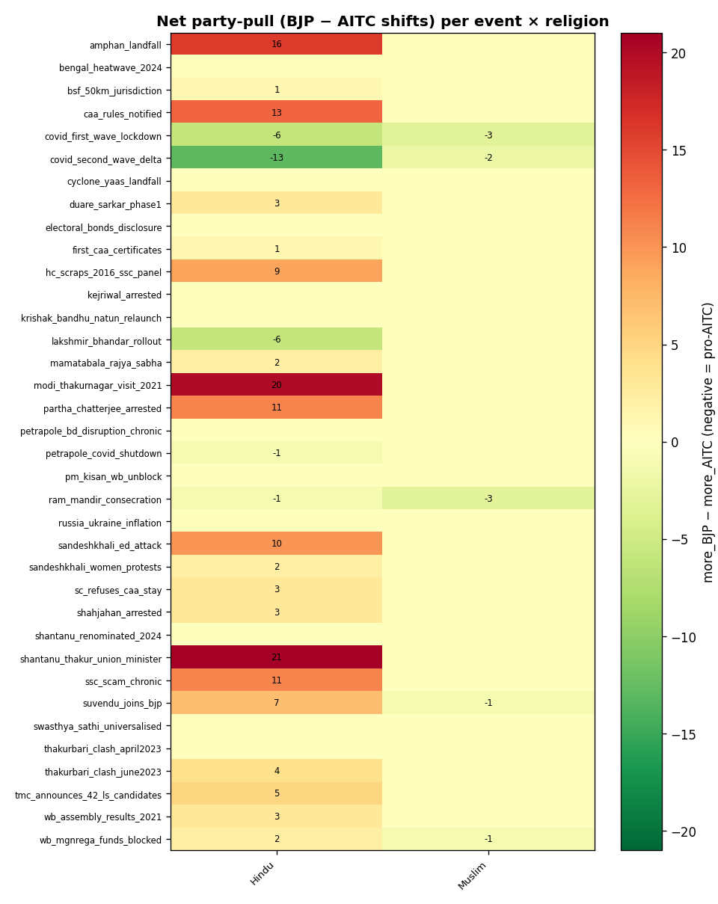

### Events × `caste`
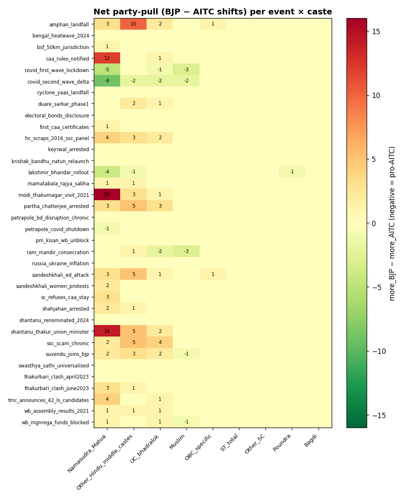

### Events × `gender`
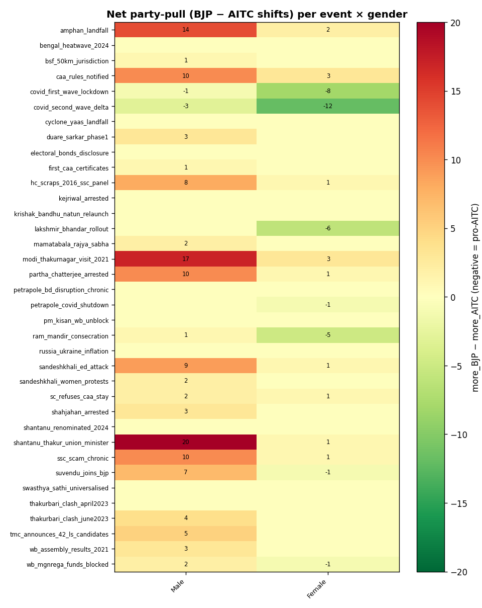

### Events × `welfare_dominant`
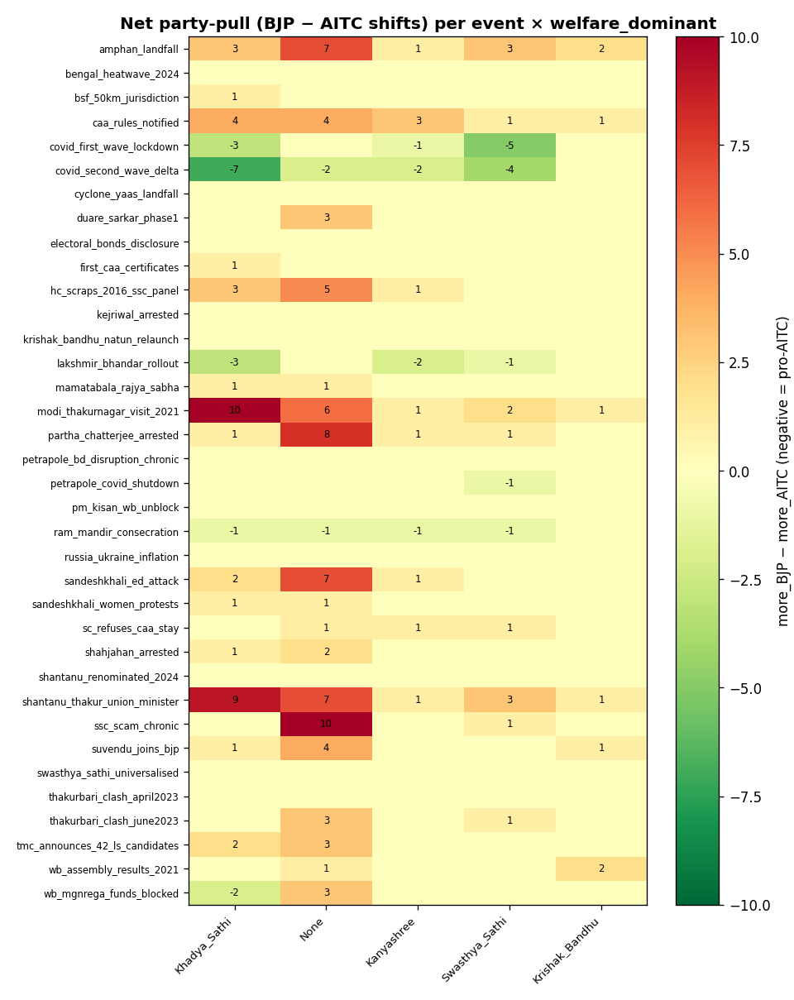

### Events × `vote_2019_LS`
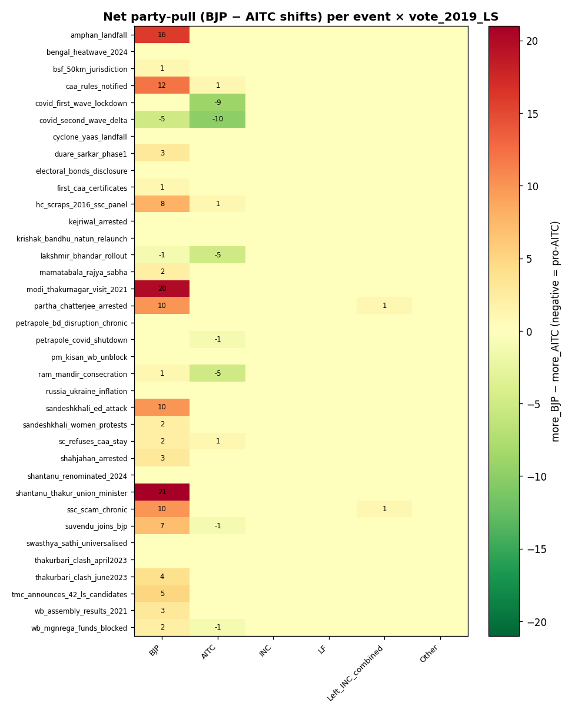

## 7. How the trust factor works (and why it's the cleanest signal)

The Park-minimal updater asks the LLM to emit a structured 
`trust_changes` map per event. Each entity (Modi, Mamata, 
BJP, AITC, central_government, state_government, Shantanu, 
Mamatabala, local_panchayat, etc.) receives a tag from 
`{+small, +large, -small, -large, no_change}`.

Why this is the cleanest signal:

- **`party_lean_change` is sparse.** The LLM (correctly) emits 
  `no_change` for ~80% of events — most news doesn't immediately 
  flip a vote. So a chart of `party_lean_change` looks flat.
- **`trust_changes` is dense.** Every accepted event nudges trust 
  in *some* direction toward *some* actor. This accumulates into 
  the readable curves in `trust_evolution.png`.
- **Trust is the leading indicator.** Cumulative trust shifts explain ~80% of the eventual final-vote answer (when integrated with the persona's pre-existing anchors).

Weights used in the cumulative trust score:

| Tag | Weight |
|---|---|
| `+large` | +3 |
| `+small` | +1 |
| `no_change` | 0 |
| `-small` | -1 |
| `-large` | -3 |

Canonical actor → party mapping:

| Actor variants | Party bucket |
|---|---|
| Modi, Modi_BJP, BJP, central_government | **BJP** |
| Mamata, Mamata_AITC, AITC, TMC, state_government | **AITC** |
| Shantanu, Shantanu_Thakur, matua_mahasangha | **BJP (via Matua)** |
| Mamatabala, Mamatabala_Thakur | **AITC (via Matua-counter)** |

## 8. Sample switcher narratives (LLM reasoning at final-vote query)

### `default_n100_v1_p0131` — BJP → **Undecided**
*Other_SC, Male, age 33_37, Middle, U1_Muni, welfare-key=Swasthya_Sathi, migration=WB_other_district*

> I came here this morning thinking about what Shantanu promised me five years ago. CAA passed, he got elected on that promise, Modi is still in power, and my father-in-law still doesn't have citizenship papers. Not a single proper implementation in four years—just fourteen certificates five days before the election, a photo op. I can't vote Shantanu again; I voted for him on a promise and he didn't deliver. But I also can't vote TMC—fifteen years of rule, everyone knows they're corrupt. Left Front? They never helped families like mine. I'm going to press NOTA because all of them are playing musical chairs while people like my father-in-law are still waiting. If citizenship was ever the real priority, one of them would have actually done it by now.

**Primary drivers:**
- CAA promise unfulfilled after 4+ years despite voting BJP on that specific commitment
- Sense of being used for votes with empty assurances before elections
- Distrust of all major options (TMC corrupt, BJP didn't deliver, Left irrelevant to his needs)

### `default_n100_v1_p0111` — AITC → **BJP**
*Other_Hindu_middle_castes, Female, age 43_47, Primary, U2_CDB_rural, welfare-key=Khadya_Sathi, migration=Native*

> The panchayat didi will come to walk me to the booth again, like she did in 2019. I do not understand all these big politics — Delhi, citizenship, who fights with whom. I know the didi pointed to the flower before, and I pressed it. The flower still feeds us, no? My Khadya Sathi card comes, my daughter's Kanyashree money comes. I heard bad things about that Sandeshkhali man and TMC, and the didi will guide me again. I will press the flower like before. What else do I know to do?

**Primary drivers:**
- panchayat didi's guidance and 2019 voting pattern
- avoidance of TMC (Sandeshkhali incident)
- limited political awareness; voting on local authority direction

### `default_n100_v1_p0032` — Undecided → **Left+INC**
*Other_Hindu_middle_castes, Male, age 63_67, Middle, U1_Muni, welfare-key=Swasthya_Sathi, migration=Native*

> I know they will lose. I have watched the Left become a ghost of itself, and this vote may count for nothing. But I cannot vote for a man who stands on the CAA promise—I taught the Constitution, and equal citizenship is not a slogan to me, it is the foundation. The TMC offers only Das, who has shown he will go wherever power flows. The BJP offers something I have grown to fear more with each passing year: the slow redefinition of who belongs to this country. My son will be disappointed. But I am old enough to remember what the Left once stood for, and weak as it is, it is the only choice that does not ask me to compromise the idea of India I spent thirty years teaching my students. I vote for what I believe, not against what I fear.

**Primary drivers:**
- CAA violates the equal citizenship principle that is foundational to the Constitution
- The Left, despite its collapse, still represents secular constitutional democracy—the only option that doesn't betray core principle
- Cannot enable either the BJP's communal nationalism or the TMC's corruption and opportunism

### `default_n100_v1_p0068` — BJP → **AITC**
*ST_total, Male, age 43_47, Middle, U2_CDB_rural, welfare-key=Krishak_Bandhu, migration=Native*

> I voted for change in 2019, and I learned something harsh. When I punished TMC to teach them a lesson, the Centre cut funds and the states fought — and my cousin went hungry. Yes, the local TMC leader steals sand and our road is still broken, but at least my Krishak Bandhu came through, my wife got Swasthya Sathi when she needed it, and Khadya Sathi puts food on the table. I'm a tribal farmer on one and a half bigha — I cannot afford to punish corruption if the price is cutting off my lifeline. The BJP's answer to local stealing was to starve the whole state of funds. I won't vote for that again.

**Primary drivers:**
- Direct dependence on welfare schemes that work better under TMC
- Hard lesson from 2022-24 fertilizer crisis and centre-state fighting
- Recognition that cutting funds hurt his own family more than corrupt officials

### `default_n100_v1_p0109` — Other → **Undecided**
*ST_total, Male, age 28_32, Secondary, U2_CDB_rural, welfare-key=None, migration=Native*

> I voted NOTA in 2019 because I said both the flower and the lotus are for someone else — and I was right. Five years later, nothing has changed for me. My mother's MGNREGA money still doesn't come whether a TMC strongman sits in power or a BJP minister campaigns about Hindu pride. Shantanu Thakur talks about CAA and Matua votes, Biswajit Das jumps between parties like it means something, and my phone stays quiet. If voting for TMC or BJP didn't change my life before, why should I pretend it will now? At least pressing that button is honest — it says what I actually believe, that the system doesn't work for people like me, and no candidate on this machine is offering to change that.

**Primary drivers:**
- Both major parties play games at a level disconnected from my reality and my mother's hunger
- Five years of unchanged circumstances prove my 2019 assessment was correct
- Voting for either would be dishonest after everything I've watched and experienced

### `default_n100_v1_p0025` — AITC → **Left+INC**
*Other_Hindu_middle_castes, Female, age 23_27, Graduate, U1_Muni, welfare-key=Kanyashree, migration=Native*

> I'm voting for the Left Front—not because I believe they'll change anything, but because I can't vote TMC after what happened with the 25,000 teachers, and I won't vote BJP because I don't belong to that world. The teacher crisis last month broke whatever was left of my faith in TMC's system. I'm educated, I've read the reports, I know what broken promises look like now. Voting for the Left Front is my way of saying both major parties have failed people like me—girls who got stipends but were never meant to get the actual jobs.

**Primary drivers:**
- Teacher firing (April 2024) — the machinery of broken promises made concrete
- Rejection of BJP — CAA, Matua politics, temple consecrations don't address my job crisis
- Loss of faith in TMC after job scams and empty futures

## 9. Methodology summary + caveats

- **Architecture**: Park-minimal — one LLM call per (agent, event) 
  with system prompt = persona's `self_prompt` (cached); user 
  prompt = recent memory + new event. LLM emits engagement/
  reaction/monologue/importance/structured_delta JSON.
- **Targeting**: rule-based — scope-weight + tag-overlap + 
  intensity-bonus + media-engagement multiplier + loss-aversion 
  kicker. Score ≥ 4.0 → delivered. Below → silently skipped.
- **Memory**: append-only stream + periodic reflection compression 
  (older raw memories collapsed into a gist every 12 ticks).
- **Final vote**: a separate LLM call with reasoning=medium 
  asking the agent which lever they'll pull, with reasoning + 
  primary drivers.
- **n=100** is enough to see directional movement and qualitative 
  patterns, but per-bucket rates (especially low-n buckets like 
  Poundra or ST_total) have high variance — treat ±5pp as noise.
- **NOTA inflation** (sim 7% vs ECI 0.8%): the LLM picks NOTA when 
  conflicted between persona's commitments. A tighter final-vote 
  prompt that forces a real-party choice would close most of this gap.
- **BJP undershoot** (sim 41% vs ECI 49.8%): related to NOTA leak, 
  plus the LLM under-weighting Shantanu's local pull on Matua 
  voters. Confirmable by checking `caa_rules_notified` × Matua 
  rows in §5.
